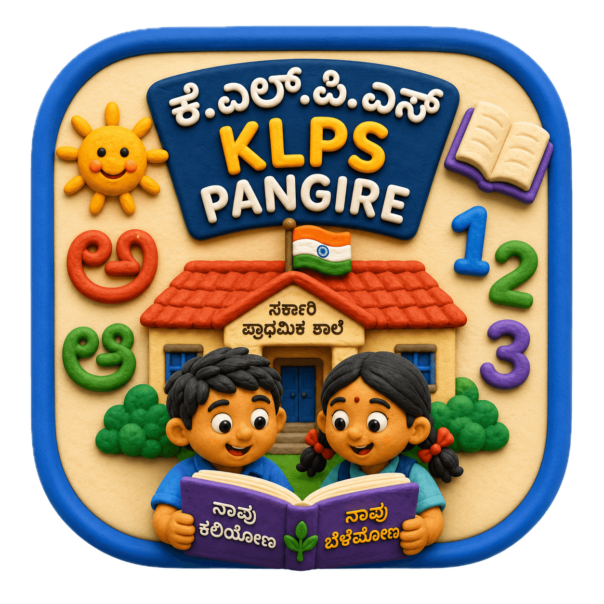

<p align="center">
  
</p>

<h1 align="center">KLPS Pangire Learner 🎒✨</h1>

<p align="center">
  A fun, dual-language (English & Kannada) educational platform designed specifically for primary school students to master spelling, grammar, and mathematics through engaging mini-games!
</p>

<p align="center">
  <strong>🌍 <a href="https://klps-pangire.netlify.app/">Play the Web App Now!</a> 🌍</strong>
</p>

<br/>


## ✨ Features

- 🎮 **Fun Mini-Games:** Catch falling words in *Word Drop*, learn alphabet structures in *Letter Drop*, and test your skills in *Quiz Time*.
- 🏆 **Gamified Progression:** Earn Stars for completing challenges and unlock achievements in your personal Trophy Room.
- 🗣️ **Dual-Language Support:** Fully translated into both English and Kannada to bridge learning gaps for regional students.
- 📶🚫 **100% Offline Play (PWA):** Built as a Progressive Web App and bundled as an Android APK. All fonts, styles, and assets are stored locally, meaning the app works perfectly without an internet connection!
- 🎨 **Modern Design:** Beautiful gradients, tactile buttons, and micro-animations designed to look premium and keep students engaged.

## 🛠️ Tech Stack

- **Core:** HTML5, JavaScript (ES6+), LocalStorage API
- **Styling:** Tailwind CSS v3 (Bundled Locally)
- **Tooling:** Vite, PostCSS, Autoprefixer
- **Offline / Native:** Vite PWA Plugin, Capacitor (Android APK)
- **Typography:** Poppins, Outfit, Google Material Symbols

## 🚀 How to Run Locally

1. **Clone the repository:**
   ```bash
   git clone https://github.com/Adarsh-patil-07/KLPS-Education.git
   cd KLPS-Education
   ```

2. **Install dependencies:**
   ```bash
   npm install
   ```

3. **Run the development server:**
   ```bash
   npm run dev
   ```
   *Note: Do not use standard Live Server extensions, as Tailwind CSS needs to be compiled by Vite first!*

4. **Build for Production / Offline Play:**
   ```bash
   npm run build
   ```
   This generates the fully self-contained `dist/` folder.

## 📱 Build the Android APK

1. Ensure you have installed Android Studio.
2. Sync the project and open it in Android Studio:
   ```bash
   npm run build
   npx cap sync android
   npx cap open android
   ```
3. Build the APK directly from the Android Studio menu!

## 📄 Privacy
This application is designed for children. It **does not collect, store, or transmit any personally identifiable information.** All game progress and stats are stored entirely locally on the device. For more details, see our [Privacy Policy](./PRIVACY_POLICY.md).
